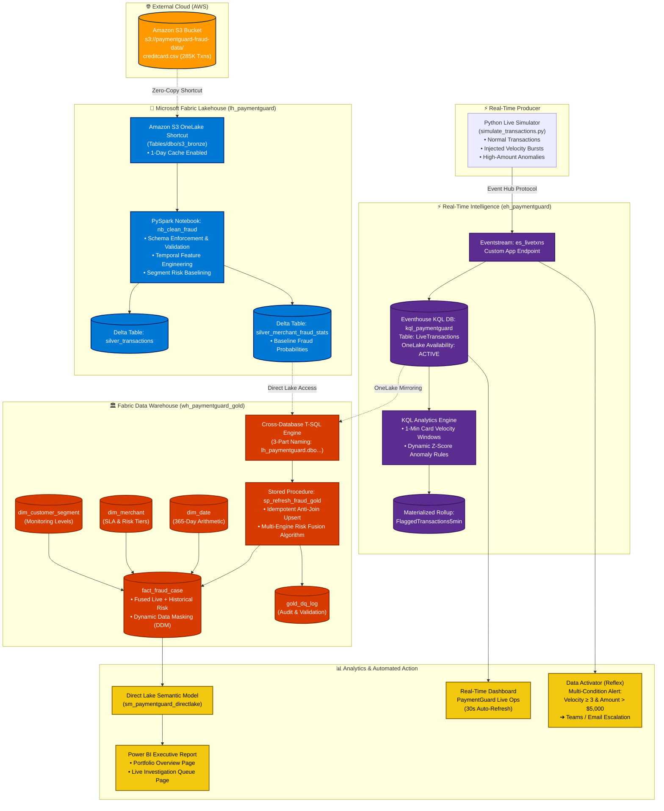

# 🛡️ PaymentGuard: End-to-End Real-Time Transaction Fraud Detection Platform
### *A Multi-Cloud, Zero-Copy Enterprise Data Architecture on Microsoft Fabric*

[](https://app.fabric.microsoft.com/)
[](https://aws.amazon.com/s3/)
[](https://spark.apache.org/)
[](https://learn.microsoft.com/en-us/fabric/real-time-intelligence/)
[](https://learn.microsoft.com/en-us/fabric/data-warehouse/)
[](https://powerbi.microsoft.com/)

---

## 🎬 Video Demo Walkthrough

[](YOUR_DEMO_VIDEO_LINK_HERE)

> 💡 **Walkthrough Video**: [Click here to watch the 3-minute end-to-end architectural demo](YOUR_DEMO_VIDEO_LINK_HERE) covering AWS S3 shortcuts, PySpark Lakehouse pipelines, Eventstream KQL streaming, Zero-Copy cross-engine fusion, and Direct Lake Power BI dashboards.

> [!TIP]
> 📖 **Looking for the step-by-step setup tutorial?**  
> Head directly to the comprehensive **[PaymentGuard Step-by-Step Implementation Guide](PAYMENTGUARD_STEP_BY_STEP_GUIDE.md)** for copy-paste code snippets, configuration parameters, and detailed architectural rationales for every step.

---

## 📌 Project Overview

**PaymentGuard** is an enterprise-grade fraud detection platform built on **Microsoft Fabric** that fuses batch processing, real-time streaming, and relational data warehousing into a single **zero-copy data mesh**.

Traditional anti-fraud platforms suffer from a painful tradeoff:
* **Batch ETL pipelines** are too slow to intercept rapid card-testing velocity attacks occurring within seconds.
* **Stream-only engines** lack the historical context and multi-dimensional modeling required to calculate merchant-segment baseline fraud exposure.
* **Multi-engine architectures** typically duplicate data repeatedly across cloud storage buckets, lakes, and warehouses, incurring steep egress and storage costs.

**PaymentGuard eliminates these tradeoffs.** By leveraging **Microsoft OneLake Shortcuts** and **Real-Time Intelligence (Eventstream + Eventhouse)**, a single T-SQL stored procedure joins streaming KQL tables and Spark Delta Lake tables in the Warehouse with **zero data movement and zero ETL copies**.

---

## 🏛️ End-to-End Architecture



---

## 🌟 Core Technical Highlights

| Capability | What It Does | Why It Matters for Enterprise |
|---|---|---|
| **Multi-Cloud Data Virtualization** | Historical transactions in **AWS S3** are shortcutted into Fabric with **1-day caching enabled**. | Eliminates cloud data transfer friction; zero egress fees on repeated Spark queries. |
| **KQL Real-Time Sliding Windows** | Sub-second sliding-window checks (`bin(txn_time, 1m)`) detect card-testing burst patterns. | Catch fraud before transactions finalize, not hours later in a batch job. |
| **OneLake Mirroring for Eventhouse** | Enables **OneLake Availability** on KQL tables (`.alter table policy mirroring`). | Automatically mirrors KQL streaming data into Delta Parquet format queryable by T-SQL. |
| **Cross-Database Zero-Copy Joins** | Fabric Warehouse queries `lh_paymentguard.dbo.LiveTransactions` directly via T-SQL. | No ETL pipeline needed between Eventhouse and Warehouse; data remains in place. |
| **Direct Lake Semantic Modeling** | Power BI reads directly from Warehouse Delta Parquet files in OneLake memory. | Sub-second report rendering without dataset size import caps or DirectQuery slowdowns. |
| **PCI-DSS Governance & Masking** | Dynamic Data Masking (DDM) on `account_id` and Row-Level Security (RLS) on segments. | Protects sensitive cardholder PII while enforcing team-based access restrictions. |

---

## 📂 Repository File Structure

```bash
paymentguard-fabric/
├── README.md                           # Master architectural overview & visual showcase
├── PAYMENTGUARD_STEP_BY_STEP_GUIDE.md  # Comprehensive step-by-step implementation guide
├── fabric-e2e-paymentguard-project.md  # Original functional specification & requirements
├── simulate_transactions.py            # Real-time transaction generator & anomaly injector
├── creditcard.csv                      # Historical Kaggle dataset (284,807 transactions, 150MB)
```

---

## 🚀 Quick Start & Implementation Walkthrough

> 📖 **Full Implementation Walkthrough**: For exact step-by-step UI instructions, full T-SQL DDL, PySpark scripts, KQL queries, and architectural rationales for every design decision, please refer to the **[Comprehensive Step-by-Step Guide](PAYMENTGUARD_STEP_BY_STEP_GUIDE.md)**.

### Phase 0: Fabric Environment Setup
1. Create a workspace named **`PaymentGuard-Fabric`** on a Fabric Capacity or Trial.
2. Provision the 3 storage engines:
   - **Lakehouse**: `lh_paymentguard`
   - **Eventhouse**: `eh_paymentguard` (KQL Database: `kql_paymentguard`)
   - **Warehouse**: `wh_paymentguard_gold`

---

### Phase 1: AWS S3 Shortcut & PySpark Feature Engineering
1. Create an AWS S3 bucket `paymentguard-fraud-data-<suffix>` and upload [`creditcard.csv`](creditcard.csv).
2. Create an **Amazon S3 Shortcut** under `lh_paymentguard/Tables` named `s3_bronze`.
   - **Enable cache for shortcuts**: Toggle **ON** (Retention: 1 day).
3. In notebook **`nb_clean_fraud`**, execute PySpark feature transformations:
   - Validate row count (284,807 rows) and log data quality exceptions.
   - Synthetically enrich PCA attributes with `merchant_category`, `customer_segment`, and `hour_of_day`.
   - Write Silver Delta tables: `silver_transactions` and `silver_merchant_fraud_stats`.

---

### Phase 2: Real-Time Stream Ingestion & KQL Analytics
1. Create an Eventstream **`es_livetxns`** with a **Custom App** source and point its destination to Eventhouse table **`LiveTransactions`**.
2. Enable **OneLake Availability** in KQL:
   ```kql
   .alter table LiveTransactions policy mirroring data_format=parquet
   ```
3. Run the streaming generator in your terminal:
   ```powershell
   $env:FABRIC_EVENTSTREAM_CONNECTION_STRING="<YOUR_EVENTSTREAM_KEY>"
   python simulate_transactions.py
   ```
4. Execute real-time detection queries in KQL:
   - **1-Minute Account Velocity Check**:
     ```kql
     LiveTransactions
     | extend txn_time = todatetime(timestamp), txn_amount = toreal(amount)
     | where txn_time > ago(1h)
     | summarize txn_count_1m = count(), total_spent = sum(txn_amount) by account_id, bin(txn_time, 1m)
     | where txn_count_1m >= 3
     ```
   - **Materialize Flagged Rollup**: Maintain `FlaggedTransactions5min` with OneLake mirroring.

---

### Phase 3: Warehouse Gold Layer & Master Orchestration Pipeline
1. In `lh_paymentguard`, create a OneLake shortcut to `kql_paymentguard` -> `LiveTransactions`.
2. In `wh_paymentguard_gold`, click **`+ Warehouses`** and add `lh_paymentguard` to the explorer.
3. Deploy the Star Schema DDL (`dim_date`, `dim_merchant`, `dim_customer_segment`, `fact_fraud_case`, `gold_dq_log`).
4. Execute stored procedure **`sp_refresh_fraud_gold`**:
   - Performs a high-performance MPP anti-join against `dbo.fact_fraud_case`.
   - Fuses live risk scores with historical fraud baselines into `fused_fraud_exposure_usd`.
5. **Master Orchestration Pipeline (`pl_master_paymentguard`)**:
   - Create a unified pipeline chaining 3 activities sequentially:
     `Run_nb_clean_fraud (Spark)` $\rightarrow$ `Run_sp_refresh_fraud_gold (T-SQL)` $\rightarrow$ `Refresh_DirectLake_Model (Power BI)`.
   - Schedule to run every 15 minutes for automated continuous synchronization across all 3 engines.

---

### Phase 4: Direct Lake Power BI & Real-Time Ops Dashboard

#### 1. Power BI Executive Report (Direct Lake)
* **Direct Lake Semantic Model**: Connected over `wh_paymentguard_gold` tables with active 1-to-many relationships.
* **DAX Measures**:
  * `[Total Cases] = COUNTROWS(fact_fraud_case)`
  * `[Escalated Cases] = CALCULATE(COUNTROWS(fact_fraud_case), fact_fraud_case[case_status] = "IMMEDIATE_ESCALATION")`
  * `[Flagged Rate] = DIVIDE(CALCULATE(COUNTROWS(fact_fraud_case), fact_fraud_case[is_live_flagged] = 1), [Total Cases], 0)`
  * `[Total Fraud Exposure USD] = SUM(fact_fraud_case[fused_fraud_exposure_usd])`
* **Visuals**: Status breakdown donut chart, category exposure bar chart, customer segment distribution, and live investigation queue.

#### 2. Eventhouse Real-Time Ops Dashboard (`PaymentGuard Live Ops`)
* 5 auto-refreshing KQL visual tiles (30-second cadence):
  1. *Live Transaction Volume & Flagged Spikes* (Time Series Area Chart)
  2. *Live Critical Incident Feed* (Table with real-time risk scores)
  3. *Card Velocity Watchlist* (Accounts with $\ge 3$ charges in 2 mins)
  4. *Dollars at Risk in Last 2 Hours* (Single Stat KPI Card)
  5. *Risk Exposure by Channel* (Bar Chart: eCommerce vs POS vs ATM)

#### 3. Automated Incident Escalation (Data Activator)
* Reflex alert configured on `es_livetxns`:
  * **Trigger**: `amount > 5000` **AND** `risk_score > 0.75`
  * **Action**: Immediate Microsoft Teams alert & Email notification to Fraud Ops queue.

---

## 🔧 Production Gotchas Solved

| Issue Encountered | Root Cause in Fabric | Production Fix Applied |
|---|---|---|
| **`[object CloseEvent]` on Spark Launch** | Regional shared Starter Pool cold-start timeout in East Asia. | Created dedicated custom mini pool (`fast-pool`: Small 4 vCores, 1 node, autoscale off) in Workspace Settings. |
| **`Semantic error: Cannot compare string and datetime`** | Eventstream ingests JSON strings, while `ago()` expects datetime. | Added explicit casts `todatetime(timestamp)`, `toreal(amount)`, and `toreal(risk_score)`. |
| **`Identity column must be of data type BIGINT`** | Fabric Warehouse rejects standard 32-bit `INT IDENTITY(1,1)`. | Updated DDL to `BIGINT IDENTITY NOT NULL` (and explicit integer keys for dimension tables). |
| **`Does not support specifying SEED or INCREMENT`** | Fabric Warehouse MPP distributes identities across nodes without fixed steps. | Used syntax `BIGINT IDENTITY NOT NULL` (omitting parentheses). |
| **`Integer precision value between 0 and 6 must be specified`** | Standard SQL defaults `DATETIME2` to precision 7, which Fabric Warehouse prohibits. | Defined all timestamp columns as **`DATETIME2(6)`**. |
| **`Windowed functions can only appear in SELECT/ORDER BY`** | CTE tally generator used `ROW_NUMBER() <= 365` in `WHERE` clause. | Replaced with set-based derived arithmetic generator (`a.d + b.d*10 + c.d*100 < 365`). |
| **Timezone Parsing Crash (`Msg 241`)** | `CAST(timestamp_string AS DATETIME2)` crashes on ISO strings with `+00:00` / `Z`. | Parsed safely using `TRY_CAST(LEFT(live.timestamp, 19) AS DATETIME2(6))`. |

---

## 📜 License

This project is licensed under the MIT License — feel free to use it for your portfolio, learning, or enterprise evaluations.
